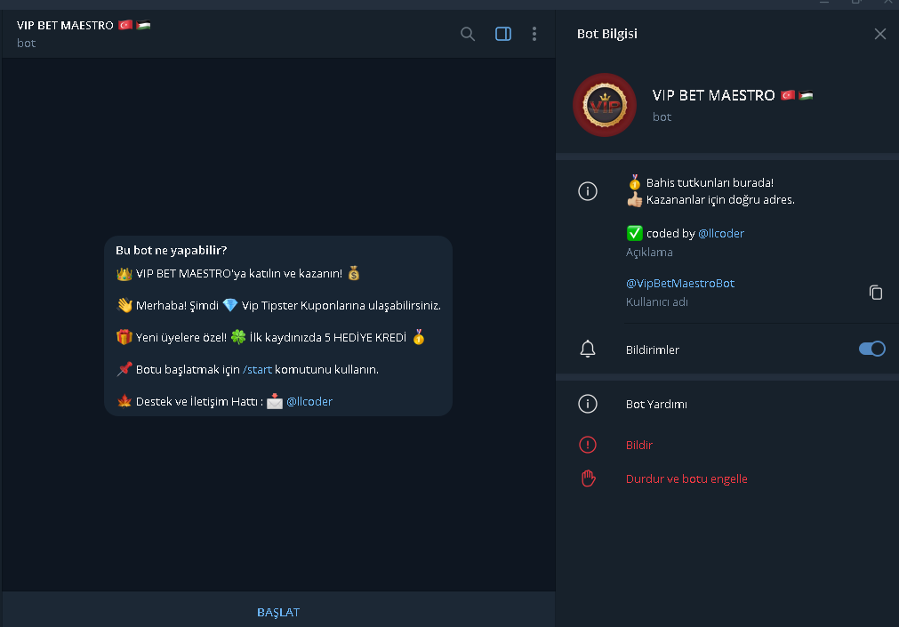
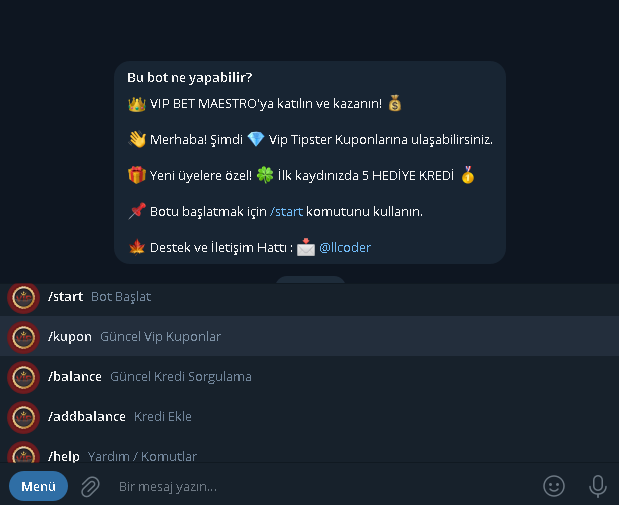
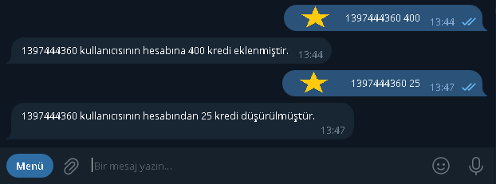

# VipBetMaestro Telegram Bot

Welcome to VipBetMaestro, an advanced Telegram bot designed for managing betting predictions from Vip Tipster participants on Nesine.com.

## Features

1. **New User Exclusive Credit (Balance) Gift System**
   - New users receive a special credit gift upon registration.

2. **User Credit Inquiry and Addition System**
   - Users can check their credit balance and add credits as needed.

3. **Withdrawal of Vip Tipster Coupons and Deduction of Credits**
   - Seamless withdrawal of Vip Tipster coupons with automatic deduction from the user's balance.

4. **Payment Notification to Admin during Credit Loading or Purchase**
   - Automatic notification to the administrator during credit loading or purchase steps.

5. **Admin-Specific Commands for User Management**
   - Special commands for administrators to efficiently manage users.

6. **Advanced Ad Display System for Users**
   - Personalized and advanced ad display system for a better user experience.

## Getting Started

1. Run the bot by executing `START.bat` in the same directory, which will launch the `vipBetMaestro_TGBOT.py` Python file.
   ```bash
   ./START.bat
   

## Screenshots










## Contact

For inquiries, contact [@llcoder](https://t.me/llcoder) on Telegram.
